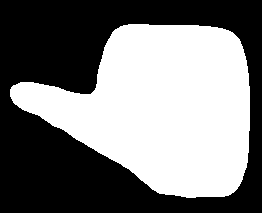
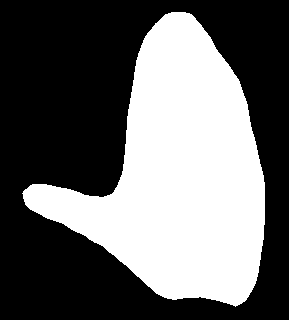
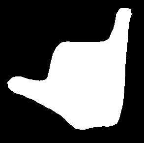
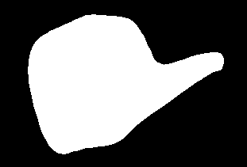
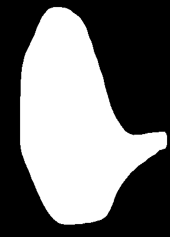
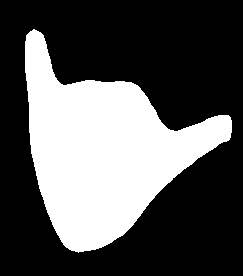
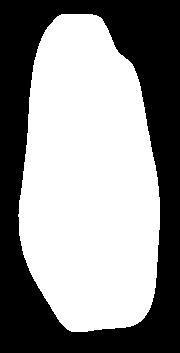
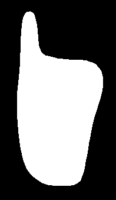
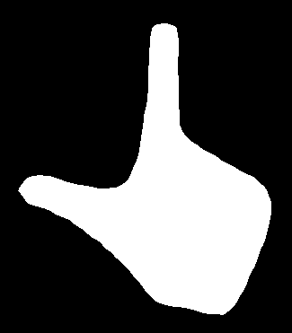
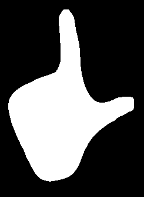

# Pytorch Mask RCNN + Egohands Dataset
This work mostly implements totrchvision tutorial: https://pytorch.org/tutorials/intermediate/torchvision_tutorial.html#putting-everything-together
using Egohands Dataset: http://vision.soic.indiana.edu/projects/egohands/
4800 images including 15000 hand segmentations were processed in order to enable one to create a efficient general-purpose hand detector.
This detector is used to play the game Inside: https://www.epicgames.com/store/pl/download/inside/home

## Features

It detects a hand!


What is more, it detects multiple hands!


You may have already guessed that, but it also detects a part of a hand!


## Prerequisites
For the project to work, you'd need modules:
Pillow, Pytorch, Opencv-python, sklearn, pynput, itertools, collections, pickle and cocoAPI
In order to get cocoAPI working on Windows OS, I followed this:https://github.com/cocodataset/cocoapi/issues/9 
After this, you also need the file with weights, approximately 350MB. Download it from my google drive and place in the repository root directory
Link to weights: https://drive.google.com/file/d/1TvvLq8WyhJAxGvG8-DIefLt4pN5AXTAX/view?usp=sharing
## Training
training process is divided into 2 experiments, first one in which I trained model on Egohands Dataset, and second one, where I used around 850 images taken with my own webcam, as close to the actual usage as one can get.
Should you want to have access to my own images, please contact me.
If you'd like to train on your own custom dataset and would like to know how I processed the Egohands dataset, please take a look at file ```extract.py ```. It contains the code which downloads, extracts and processes whole 4800 images from the dataset, and places the masks in 4 subdirectories inside masks/ folder. Although the code is very straightforward, the way to decode .mat file I took from https://github.com/victordibia/handtracking, so there you should look for answers to your questions, should you have any. The things that differ between my work and above mentioned project is the output format is different and I'm interested in not only bounding boxes, but also segmentation masks.
## Camera Client
I created a simple camera client, which grabs frames from my webcam, feeds it into Mask-RCNN, and extracts the mask of user's hand into a simple SVC classificator trained purely on my own 850 images implementing 10 different gestures, around 80 images per gesture.
The SVC classificator uses the mask image, resized to 64-by-64 pixel image. I use openCV to calculate Moments and Hu Moments of the resulting mask image, and feed it to SVC for classification. I split dataset 80-20, and the confusion matrix on test dataset is practically a diagonal matrix, with accuracy always over 98%. 
You can see the end result here: https://youtu.be/IAbqIXAirFY


## Implemented gestures
I implemented 10 gestures:
1. walk left:



2. walk left and up:



3. walk left and down:



4. walk right:



5. walk right and up:



6. walk right and down:



7. walk up/jump:



8. walk down:



9. walk left + action button:



10. walk right + action button:



## How to use
```python camera_client.py ```is the way to go. Beware, it uses opencv to access the first available camera connected to your PC. Camera resolution used is **1280x720**, changing the resolution would require you to resize the image before feeding it to Mask-RCNN. Obviously it won't work if there's no camera or the selected camera is currently busy.
After launching, you should wait a moment for the models to load, and after you see the camera press key **s** on your keyboard to **start** maskrcnn. after maskrcnn started, you can the gesture recognition and toggle keyboard press simulation with a **space**. to quit the program, you should press **q**. All of the keypresses must be made when opencv's window is selected as the main app.
I also implemented a trackbar above the camera view, it is used to select the accuracy used to threshold the mask of the hand, but it does not affect in any way the classification, it is used only to visualise what regions are selected with higher accuracy. Increasing the accuracy decreases hand's surface
## Motivation
I did this project as a part of one course during my studies. I chose Inside game because it was free on Epic Games a while ago.
